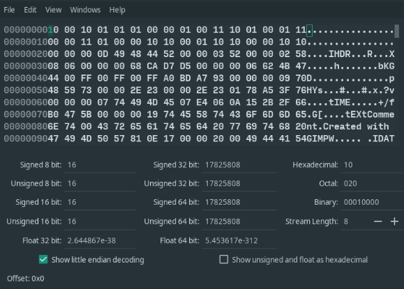
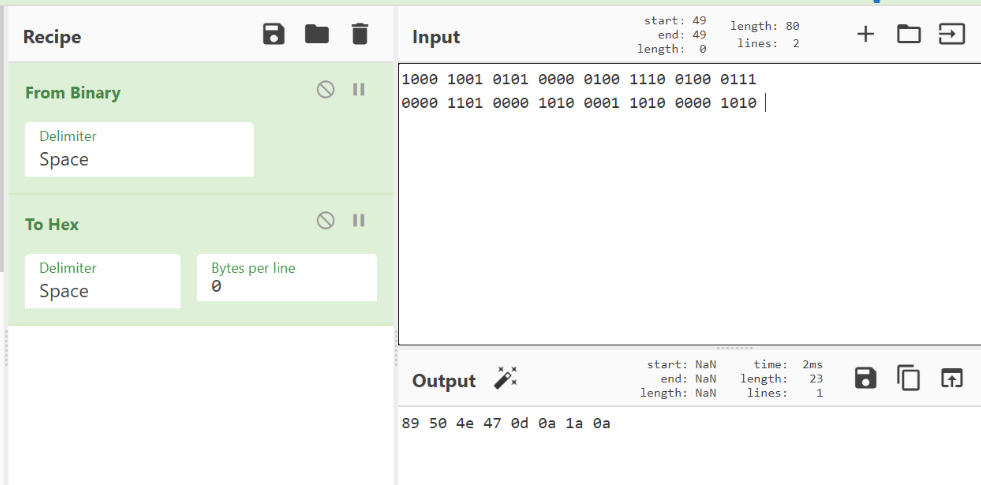
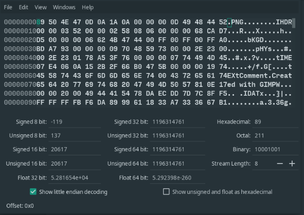
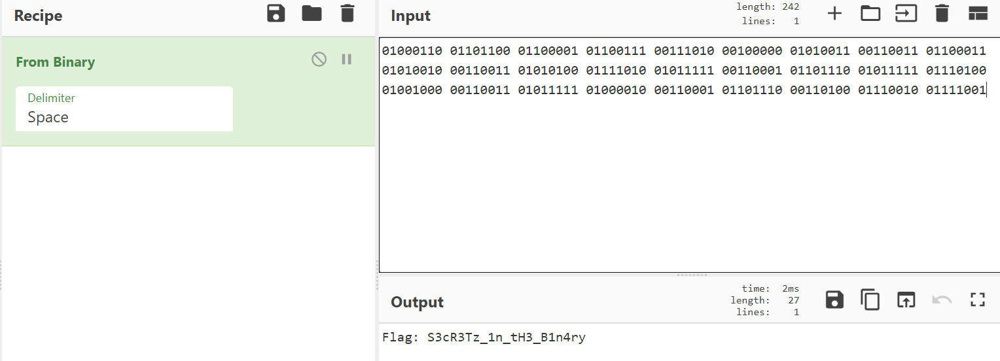

Email: emilybest878@hotmail.com
# Hex In The Bin
## Flag
Flag: `S3cR3Tz_1n_tH3_B1n4ry`
## Briefing
Our Agents think they have found an image on a machine, but it seems to be corrupt. Can you download the file and see if you can retrieve the flag?

By Emily
#### Optional Hint:
Where is my head...err...
## Infrastructure 
* The file will need to able to be downloaded from the CTF platform. 
## Risks
To the best of my knowledge, there are no risks associated with the files involved in this challenge.

## Walkthrough
1. First, the user would download the file from the CTF platform.
1. Once the file has been downloaded, the user would open the file in a hex editor, or another program which allows them to view the hex of the file.
1. Upon close inspection, the user will notice a string of binary at the top of the file:
  
1. The user will then use a tool such as CyberChef to convert the binary to hexadecimal:
  
  They will notice that the Binary translated to hex is the header for a PNG file: 
    ```
    1000 1001 0101 0000 0100 1110 0100 0111 0000 1101 0000 1010 0001 1010 0000 1010
    =
    89 50 4E 47 0D 0A 1A 0A
    ```
1. The user will then use a hex editor such as ghex to replace the binary with the hex they have just created:
  
1. The user will now be able to open the file, and will see the following:
  
1. Upon close inspection of the image, (perhaps using an image editor to increase the contrast between the two shades of grey) the user will notice the binary at the bottom of the image.
    ```
    01000110 01101100 01100001 01100111 00111010 00100000 01010011 00110011 01100011 01010010 00110011 01010100 01111010 01011111
    00110001 01101110 01011111 01110100 01001000 00110011 01011111 01000010 00110001 01101110 00110100 01110010 01111001
    ```
    Using a tool such as CyberChef, the user can decode the binary to produce the flag:
    
    Flag: `S3cR3Tz_1n_tH3_B1n4ry`
 
    
